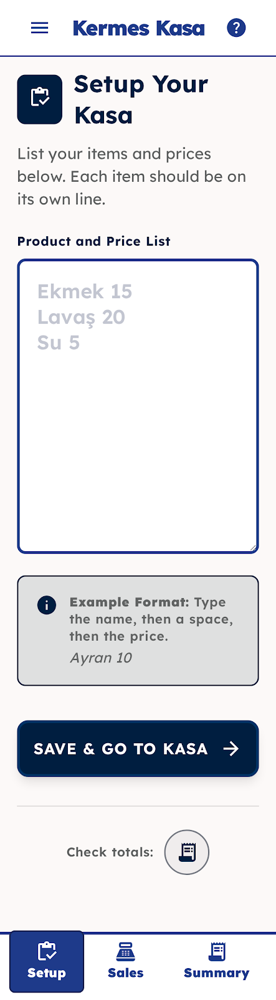
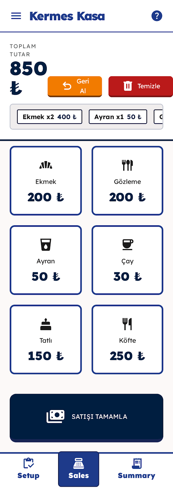
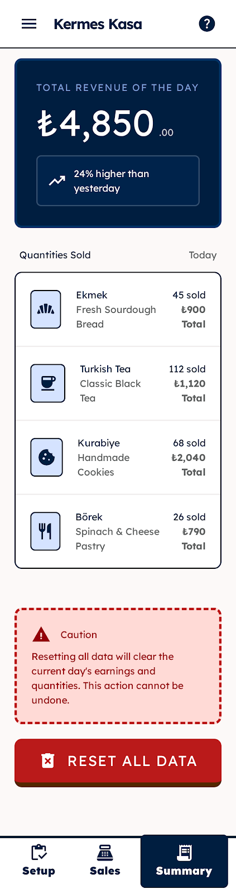

# 🛒 Kermes Kasa - Erişilebilir ve Hızlı Kasa Takip Uygulaması


-orange)

## 📖 Proje Hakkında
Kermes Kasa; kermesler, geçici etkinlikler ve saha satış noktaları için **Expo (React Native)** altyapısıyla geliştirilmiş evrensel bir kasa yönetim uygulamasıdır. 

Bu proje, sadece bir satış aracı olmanın ötesinde, **maksimum bilişsel kolaylık ve görsel erişilebilirlik** prensipleriyle mühendislik süzgecinden geçirilmiştir. Özellikle yaşlı yetişkinler veya teknolojiye aşina olmayan gönüllüler düşünülerek tasarlanmış; karmaşık UI desenleri yerine doğrudan, yüksek kontrastlı ve güven veren bir arayüz kurgulanmıştır.

## 🎨 Tasarım Sistemi ve Erişilebilirlik (UX/UI)
Uygulamanın arayüzü, hata payını sıfıra indirmek ve kullanıcının bağımsızlık hissini artırmak için özel bir "Design System" üzerine inşa edilmiştir:

* **Tipografi (Lexend):** Görsel stresi azaltmak ve okuma performansını artırmak için özel olarak *Lexend* yazı tipi kullanılmıştır. Görme hassasiyeti (presbiyopi) olan kullanıcılar için minimum gövde metni boyutu **20px** olarak ayarlanmış, satır aralıkları ferah tutulmuştur.
* **Genişletilmiş Dokunmatik Alanlar (Touch Targets):** Standart 48px yerine, motor becerilerdeki hassasiyet kayıplarını tolere edebilmek için butonlar ve etkileşimli alanlar minimum **64px** yüksekliğinde tasarlanmıştır.
* **Yüksek Kontrastlı Renk Paleti:** * **Koyu Lacivert (Primary - #001e40):** İstikrar ve güven hissi vermek için başlıklar ve ana butonlarda kullanılmıştır.
    * **Kırmızı (Error - #ba1a1a):** Yalnızca "Sil", "Temizle" veya "Durdur" gibi kritik ve geri dönülemez eylemler için ayrılmıştır.
    * **Turuncu:** "Geri Al" (Undo) gibi eylemler için kullanılarak standart onaylamalardan görsel olarak ayrıştırılmıştır.
* **Derinlik ve Gölgelendirme:** Yaşlı gözlerde bulanık veya belirsiz görünebilen hafif gölgeler (soft shadows) yerine, net hiyerarşi sağlamak için **2px kalınlığında net kenarlıklar (bold borders)** ve tonal katmanlar tercih edilmiştir.

## ✨ Temel Ekranlar ve İşlevler

### 1. Kurulum (Setup) Ekranı
Etkinlik öncesi menünün ve fiyatların sisteme tanıtıldığı operasyon merkezidir.
* **Akıcı Veri Girişi:** Karmaşık formlar yerine, ürün adı ve fiyatı aynı satıra yazılarak (Örn: `Ekmek 15`) saniyeler içinde menü oluşturulur.
* Net, 2px kenarlıklı giriş alanları sayesinde kullanıcı odak noktasını (focus) asla kaybetmez.
<br>

> 

---

### 2. Satış (Sales) Ekranı
Kullanıcı deneyiminin en üst seviyeye çıktığı hızlı reaksiyon ekranıdır.
* Okunabilirliği maksimize edilmiş ikonlu devasa ürün butonları.
* Dinamik sepet yapısı ve Turuncu "Geri Al", Kırmızı "Temizle" butonlarıyla anında müdahale şansı.
* Ekrana tam oturan, kenarlardan 24px güvenli boşluk (margin) bırakılmış, parmakların cihaza yanlışlıkla dokunmasını önleyen akışkan ızgara (fluid grid) yapısı.
<br>

> 

---

### 3. Gün Sonu Özeti (Summary) Ekranı
Finansal hasılatın ve ürün analizinin yapıldığı, veri odaklı paneli temsil eder.
* Günlük toplam geliri ve dünkü hasılata göre artış grafiğini en tepede net olarak sunar.
* Tüm verileri sıfırlama işlemi (Reset All Data), yüksek opaklıklı bir "Tehlike Alanı" (Danger Zone) içinde sunularak yanlışlıkla basılmaların önüne geçer.
<br>

> 

## 🚀 Geliştirme Ortamı ve Kurulum 

Bu proje [`create-expo-app`](https://www.npmjs.com/package/create-expo-app) ile oluşturulmuştur. Projeyi kendi bilgisayarınızda (local) çalıştırmak için aşağıdaki adımları izleyebilirsiniz.

**1. Bağımlılıkları Yükleyin:**
```bash
npm install
